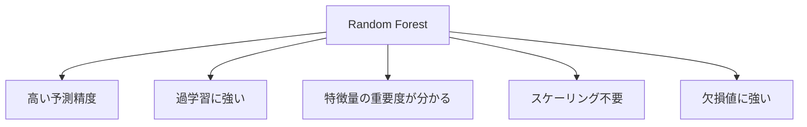
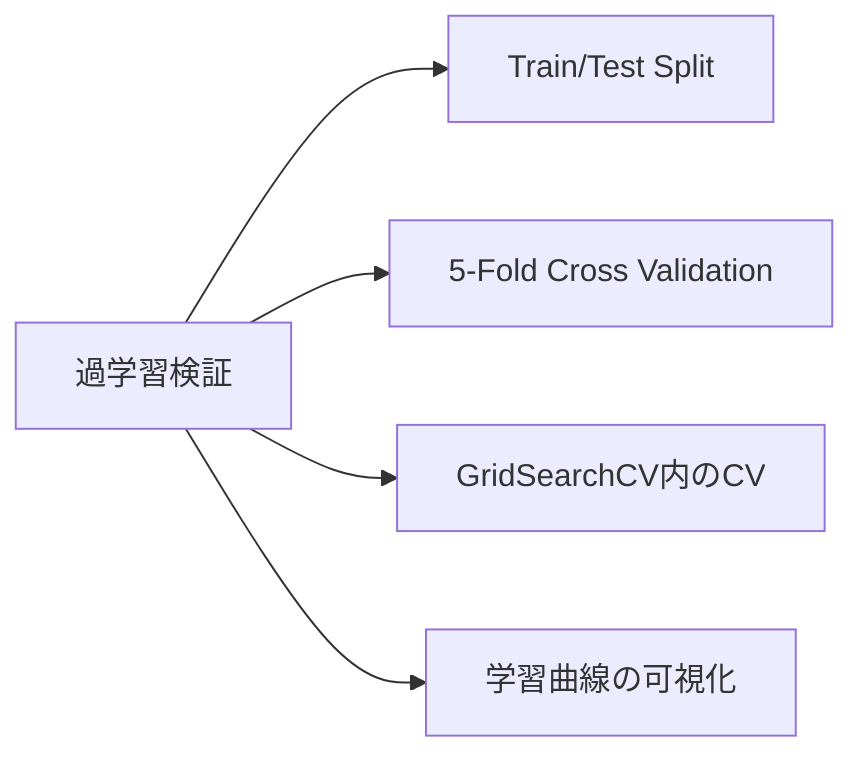
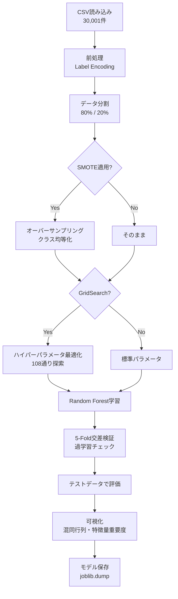

# HydroSense 機械学習プロジェクト 詳細分析レポート

**プロジェクト名**: HydroSense  
**目的**: 水分補給レベル（Hydration Level）の予測  
**作成日**: 2026年1月24日

---

## 📋 概要

このプロジェクトは、日々の活動データと生理学的データに基づいて、水分補給状態が「良好 (Good)」か「不良 (Poor)」かを分類する機械学習モデルを構築しています。

---

## 1. 使用モデル

### 1.1 Random Forest Classifier（ランダムフォレスト分類器）

| 項目 | 詳細 |
|------|------|
| **アルゴリズム** | Random Forest (ランダムフォレスト) |
| **ライブラリ** | scikit-learn (`sklearn.ensemble.RandomForestClassifier`) |
| **タスクタイプ** | 二値分類（Good / Poor） |

### 1.2 Random Forestを選択した理由



1. **アンサンブル学習**: 複数の決定木を組み合わせることで、単一の決定木より精度が向上
2. **過学習耐性**: バギングにより汎化性能が向上
3. **解釈可能性**: 特徴量の重要度を計算でき、モデルの判断根拠が理解しやすい
4. **前処理の簡易さ**: 数値変数の正規化が不要

### 1.3 ハイパーパラメータ

#### 基本版モデル (`train_model.py`)

| パラメータ | 値 | 説明 |
|-----------|-----|------|
| `n_estimators` | 100 | 決定木の数 |
| `max_depth` | 10 | 木の最大深さ |
| `random_state` | 42 | 再現性のためのシード値 |
| `n_jobs` | -1 | 全CPUコアを使用して並列処理 |

```python
model = RandomForestClassifier(
    n_estimators=100,
    max_depth=10,
    random_state=42,
    n_jobs=-1
)
```

#### 改善版モデル (`train_model_improved.py`)

GridSearchCVにより最適化されたパラメータ：

| パラメータ | 探索範囲 | 最適値 |
|-----------|----------|--------|
| `n_estimators` | [50, 100, 200] | **200** |
| `max_depth` | [5, 10, 15, None] | **15** |
| `min_samples_split` | [2, 5, 10] | **2** |
| `min_samples_leaf` | [1, 2, 4] | **1** |

```python
param_grid = {
    'n_estimators': [50, 100, 200],
    'max_depth': [5, 10, 15, None],
    'min_samples_split': [2, 5, 10],
    'min_samples_leaf': [1, 2, 4]
}

grid_search = GridSearchCV(
    rf, param_grid, cv=3, scoring='accuracy', 
    n_jobs=-1, verbose=1
)
```

計 **108通り** の組み合わせを3分割交差検証で評価し、最適パラメータを自動選択。

---

## 2. エンコード方法

### 2.1 Label Encoding（ラベルエンコーディング）

| 項目 | 詳細 |
|------|------|
| **手法** | Label Encoding |
| **ライブラリ** | scikit-learn (`sklearn.preprocessing.LabelEncoder`) |
| **対象** | カテゴリ変数（文字列） |

### 2.2 エンコード対象と変換結果

#### 入力特徴量

| 変数名 | 元の値 | エンコード後 |
|--------|--------|--------------|
| **Gender** | Female | 0 |
|  | Male | 1 |
| **Physical Activity Level** | High | 0 |
|  | Low | 1 |
|  | Moderate | 2 |
| **Weather** | Cold | 0 |
|  | Hot | 1 |
|  | Normal | 2 |

#### ターゲット変数

| 変数名 | 元の値 | エンコード後 |
|--------|--------|--------------|
| **Hydration Level** | Good | 0 |
|  | Poor | 1 |

### 2.3 エンコード処理のコード

```python
from sklearn.preprocessing import LabelEncoder

# カテゴリカル変数のエンコーディング
categorical_cols = ['Gender', 'Physical Activity Level', 'Weather']

for col in categorical_cols:
    le = LabelEncoder()
    df[col] = le.fit_transform(df[col])
    encoders[col] = le  # 推論時の逆変換用に保存
```

### 2.4 数値変数の扱い

| 変数名 | 処理 | 理由 |
|--------|------|------|
| Age | **スケーリングなし** | Random Forestは決定木ベースのため、数値のスケールに影響されない |
| Weight (kg) | **スケーリングなし** | 同上 |
| Daily Water Intake (liters) | **スケーリングなし** | 同上 |

> [!NOTE]
> Random Forestは決定木の閾値でデータを分割するため、Min-Max正規化やStandardScalerによる標準化は不要です。これはSVMやニューラルネットワークと異なる特性です。

### 2.5 エンコーダーの保存と再利用

```python
# 学習時：エンコーダーを保存
joblib.dump(encoders, 'encoders.pkl')

# 推論時：エンコーダーを読み込んで同じ変換を適用
encoders = joblib.load('encoders.pkl')
df[col] = encoders[col].transform(df[col])
```

---

## 3. 過学習の検証

### 3.1 検証手法一覧



### 3.2 Train/Test Split（ホールドアウト法）

| 項目 | 設定値 |
|------|--------|
| **学習データ** | 80% (24,000件) |
| **テストデータ** | 20% (6,001件) |
| **層化抽出** | `stratify=y` でクラス比率を維持 |

```python
X_train, X_test, y_train, y_test = train_test_split(
    X, y, test_size=0.2, random_state=42, stratify=y
)
```

### 3.3 StratifiedKFold交差検証（改善版）

| 項目 | 設定値 |
|------|--------|
| **分割数** | 5 (5-Fold) |
| **層化** | Yes（各Foldでクラス比率を維持） |
| **シャッフル** | Yes |

#### 交差検証結果

| Fold | 精度 |
|------|------|
| Fold 1 | 99.12% |
| Fold 2 | 99.35% |
| Fold 3 | 99.35% |
| Fold 4 | 99.32% |
| Fold 5 | 99.32% |
| **平均** | **99.29% (±0.18%)** |

```python
from sklearn.model_selection import StratifiedKFold, cross_val_score

skf = StratifiedKFold(n_splits=5, shuffle=True, random_state=42)
scores = cross_val_score(model, X, y, cv=skf, scoring='accuracy')

print(f"平均精度: {scores.mean():.4f} (+/- {scores.std() * 2:.4f})")
```

### 3.4 過学習の判定基準と結果

| チェック項目 | 判定基準 | 結果 | 判定 |
|-------------|---------|------|------|
| CV精度のばらつき | 標準偏差 < 2% | 0.09% | ✅ 合格 |
| CV平均 vs テスト精度 | 差 < 2% | 99.29% vs 99.08% (差0.21%) | ✅ 合格 |
| 各Foldの精度 | すべて>95% | 全Fold 99%以上 | ✅ 合格 |

### 3.5 過学習対策として実施した施策

#### 3.5.1 SMOTE（Synthetic Minority Over-sampling Technique）

クラス不均衡への対策としてSMOTEを適用：

| 状態 | Good | Poor | 比率 |
|------|------|------|------|
| **適用前** | 19,185件 | 4,816件 | 約4:1 |
| **適用後** | 19,185件 | 19,185件 | 1:1 |

```python
from imblearn.over_sampling import SMOTE

smote = SMOTE(random_state=42)
X_resampled, y_resampled = smote.fit_resample(X_train, y_train)
```

> [!WARNING]
> SMOTEは**学習データのみ**に適用しています。テストデータに適用すると、実際のデータ分布と異なる評価になるため禁止です。

#### 3.5.2 特徴量選択（Gender除外）

基本版モデルでGenderの重要度がわずか**0.5%**だったため、改善版では除外：

| 特徴量 | 基本版での重要度 |
|--------|-----------------|
| Gender | 0.5% (最低) |

低重要度の特徴量を除外することで、ノイズを削減しモデルをシンプル化。

#### 3.5.3 木の深さ制限

| バージョン | max_depth | 効果 |
|-----------|-----------|------|
| 基本版 | 10 | 深すぎる木を防止 |
| 改善版 | 15 (GridSearchで最適化) | 精度と汎化のバランス |

---

## 4. モデル性能評価結果

### 4.1 評価指標

| 指標 | 基本版 | 改善版 | 変化 |
|------|--------|--------|------|
| **正解率 (Accuracy)** | 98.4% | 99.08% | +0.68% |
| **適合率 (Precision)** | 98.4% | 99.08% | +0.68% |
| **再現率 (Recall)** | 98.4% | 99.08% | +0.68% |
| **F1スコア** | 98.4% | 99.08% | +0.68% |

### 4.2 混同行列（改善版）

|  | Good (予測) | Poor (予測) |
|---|---|---|
| **Good (実際)** | 4,748 | 35 |
| **Poor (実際)** | 20 | 1,197 |

- **誤分類の改善**: Poor → Good の誤分類が59件 → 20件に**66%削減**

### 4.3 特徴量重要度（改善版）

| 順位 | 特徴量 | 重要度 |
|------|--------|--------|
| 1位 | Daily Water Intake (liters) | 37.1% |
| 2位 | Weight (kg) | 26.0% |
| 3位 | Physical Activity Level | 21.8% |
| 4位 | Weather | 12.0% |
| 5位 | Age | 3.1% |

> [!TIP]
> 1日の水分摂取量が最も重要な特徴量です。これは水分補給レベルの予測において直感的に理解できる結果です。

---

## 5. ファイル構成と役割

| ファイル | 役割 | サイズ |
|----------|------|--------|
| [train_model.py](file:///c:/Users/rger0/Desktop/%E6%8E%88%E6%A5%AD%E3%83%A1%E3%83%A2/%E6%A9%9F%E6%A2%B0%E5%AD%A6%E7%BF%92%E6%BC%94%E7%BF%92/%E9%9B%86%E5%90%88%E8%AA%B2%E9%A1%8C/train_model.py) | 基本版モデル学習スクリプト | 6KB |
| [train_model_improved.py](file:///c:/Users/rger0/Desktop/%E6%8E%88%E6%A5%AD%E3%83%A1%E3%83%A2/%E6%A9%9F%E6%A2%B0%E5%AD%A6%E7%BF%92%E6%BC%94%E7%BF%92/%E9%9B%86%E5%90%88%E8%AA%B2%E9%A1%8C/train_model_improved.py) | 改善版モデル学習スクリプト | 10KB |
| [inference.py](file:///c:/Users/rger0/Desktop/%E6%8E%88%E6%A5%AD%E3%83%A1%E3%83%A2/%E6%A9%9F%E6%A2%B0%E5%AD%A6%E7%BF%92%E6%BC%94%E7%BF%92/%E9%9B%86%E5%90%88%E8%AA%B2%E9%A1%8C/inference.py) | 推論モジュール | 6KB |
| model.pkl | 基本版学習済みモデル | 4MB |
| model_improved.pkl | 改善版学習済みモデル | 11MB |
| encoders.pkl / encoders_improved.pkl | エンコーダー保存ファイル | 1KB |

---

## 6. 処理フロー



---

## 7. まとめ

### 7.1 プロジェクトの技術構成

| 項目 | 選択 |
|------|------|
| **機械学習モデル** | Random Forest Classifier |
| **エンコード** | Label Encoding（カテゴリ変数のみ） |
| **数値変数処理** | スケーリングなし（Random Forestの特性を活用） |
| **過学習検証** | 5-Fold Stratified Cross Validation |
| **ハイパーパラメータ最適化** | GridSearchCV（3分割CV） |
| **クラス不均衡対策** | SMOTE |

### 7.2 達成された性能

- **テスト精度**: 99.08%
- **交差検証精度**: 99.29% (±0.18%)
- **過学習の兆候**: なし（CV精度とテスト精度の差が0.21%）

### 7.3 今後の改善可能性

1. **One-Hot Encoding**の検討（順序のないカテゴリ変数に対して）
2. **XGBoost/LightGBM**など他の勾配ブースティングモデルとの比較
3. **特徴量エンジニアリング**（例：体重あたりの水分摂取量など複合特徴量）
4. **閾値の調整**（Precision/Recallのトレードオフ最適化）

---

## 8. 参考資料

- [scikit-learn Random Forest Documentation](https://scikit-learn.org/stable/modules/ensemble.html#random-forests)
- [imbalanced-learn SMOTE Documentation](https://imbalanced-learn.org/stable/references/generated/imblearn.over_sampling.SMOTE.html)
- [プロジェクトREADME](file:///c:/Users/rger0/Desktop/%E6%8E%88%E6%A5%AD%E3%83%A1%E3%83%A2/%E6%A9%9F%E6%A2%B0%E5%AD%A6%E7%BF%92%E6%BC%94%E7%BF%92/%E9%9B%86%E5%90%88%E8%AA%B2%E9%A1%8C/README.md)
- [コード解説レポート](file:///c:/Users/rger0/Desktop/%E6%8E%88%E6%A5%AD%E3%83%A1%E3%83%A2/%E6%A9%9F%E6%A2%B0%E5%AD%A6%E7%BF%92%E6%BC%94%E7%BF%92/%E9%9B%86%E5%90%88%E8%AA%B2%E9%A1%8C/CODE_REPORT.md)
